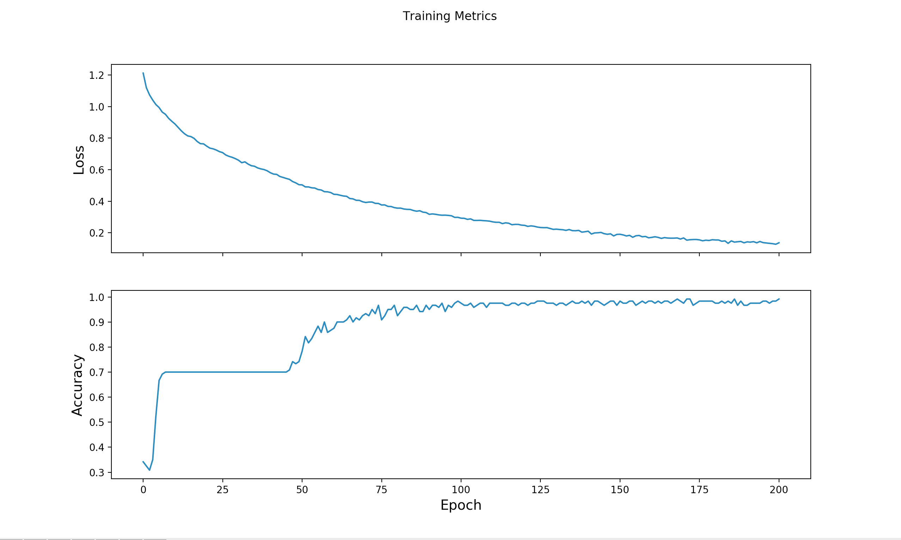

# Final Project
[Agnes Donat](https://github.com/agnesdonat) || [Chiaki Mizuta](https://github.com/chiakimz) || [George Drayson](https://github.com/GeorgeDrayson) || [Raefe Newton-Jones](https://github.com/Raefey)
> For the things we have to learn before we can do them, we learn by doing them.<br>
Aristotle

## Introduction

We are four novice software developers who have been teamed up based on their interest in studying Machine Learning. Our final project, delivered in just 9 days, is a website, documenting our journey from knowing little to nothing about Machine Learning to being able to train a bot that evaluates numbers to numbers type of data sets. We are all passionate about test driven development and well-crafted code, as well as following best practices of the SOLID principles taught at Makers Academy. Please take a look at how we used a classic supervised learning example to categorise Iris flowers by species then developed this boilerplate to train our bot to make predictions on different data sets.

## Tech Stack

#### Backend/Frontend

* Python
* TensorFlow
* ReactJS

#### Testing

* unittest

#### Deployment

* Docker


#### Libraries

* Matplotlib

## Getting started
You will need to [download python](https://www.python.org/downloads/) to run the program. We also recommend installing [virtual environment](http://www.pythonforbeginners.com/basics/how-to-use-python-virtualenv).

1. Fork and clone this repository
2. Go into the folder of your choice, e.g.:
  ```
  cd iris
  ```
3. Start the virtual environment:
  ```
  source ./bin/activate
  ```
4. Download [TensorFlow](https://www.tensorflow.org/install/):
  ```
  pip3 install --upgrade tensorflow
  ```
5. Next we need to install [Matplotlib](https://matplotlib.org/users/installing.html):
  ```
  python -mpip install -U matplotlib
  ```

## Running backend tests

1. cd to the folder of your choice then run the test file, e.g.:
```
python test_iris.py
```
## Process
### Week 1

  <strong>Monday:</strong> Started individual research on Machine Learning. We set up two Trello boards: one for sharing useful links to articles and videos and one for task delegation.<br>

  <strong>Tuesday:</strong> In the morning, we reviewed each others' FizzBuzz code written in Python, tested with Pytest and continued with more research. Later, we made a decision that instead of training a deep learning car with Reinforcement Learning, we would focus on our journey of learning about Machine Learning.<br>

  <strong>Wednesday:</strong> Working in pairs, we worked our way through TensorFlow's Eager Execution tutorial of categorising Iris flowers by species to have a better understanding of its syntax and how a simple supervised learning project builds up.<br>

  <strong>Thursday:</strong> Swapping pairs, we looked into testing the code we studied the previous day and finding a solution for serialising our Python object so we can save our trained bot. We were experimenting Python's pickle module but eventually we dropped this idea and used TensorFlow's Saver class. <br>

  <strong>Friday:</strong> Chiaki and George were working on saving and restoring the trained bot, while Raefe and Agnes were testing for the program printing graphs for Loss and Accuracy.

  By the end of the week, we had a basic understanding of Machine Learning concepts, and a fully tested and trained Model for categorising Iris flowers that also returned its loss and accuracy results in graphs.

  
