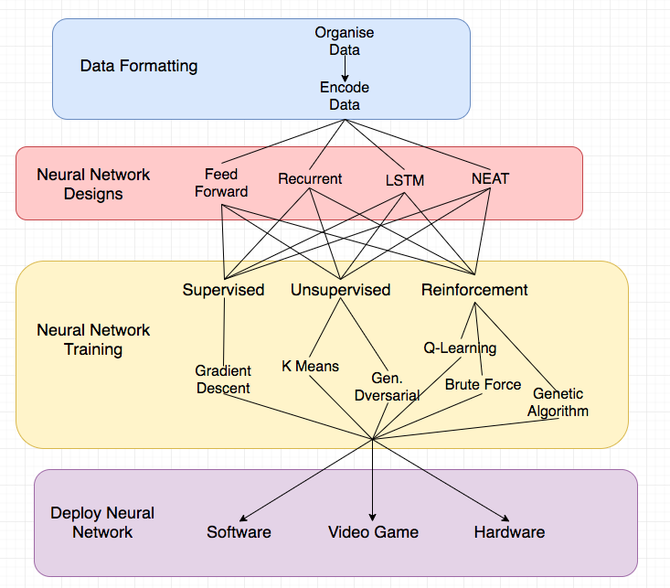

# Final Project
[Agnes Donat](https://github.com/agnesdonat) || [Chiaki Mizuta](https://github.com/chiakimz) || [George Drayson](https://github.com/GeorgeDrayson) || [Raefe Newton-Jones](https://github.com/Raefey)
> "For the things we have to learn before we can do them, we learn by doing them" - Aristotle

## Introduction

We are four software developers doing a project in Machine Learning. Our final project, delivered in just 7 days, is a series of bots trained with supervised learning that can predict if someone has diabetes or if a tumour is benign or malignant. We are all passionate about Test Driven Development and well-crafted code, as well as following best practices of the SOLID principles taught at Makers Academy.

## Tech Stack

#### Written in
* Python

#### Displayed with
* TensorBoard

#### Testing
* unittest with TensorFlow's testing library

#### Libraries
* TensorFlow
* Matplotlib

## Getting started

1. Fork and clone this repository
2. Go into the iris folder
  ```
  cd iris
  ```
3. Start the virtual environment:
  ```
  source ./bin/activate
  ```
4. Download [TensorFlow](https://www.tensorflow.org/install/):
  ```
  pip3 install --upgrade tensorflow
  ```

## Unit tests

Go to the folder of your choice then run the test file, e.g.:
```
python test_iris.py
```
## Test coverage

First you will need to install the coverage library:
```
pip install coverage
```
Then, run this command with the test you want to get coverage on. Eg:
```
coverage run test_iris.py
```
To see the coverage for that test, run:
```
coverage report
```

## Training the bot

Go to the folder of your choice then run the training file, e.g.:
```
python iris_training_controller.py
```

## To run Tensorboard

Go to the folder of the dataset you want to observe, e.g.: 'iris_flower_categoriser' or 'diabetes_predictor'

and run 
```
tensorboard --logdir='.'
```

and go to localhost:6006 on your browser!

## Process
### Week 1

  <strong>Monday:</strong> Started individual research on Machine Learning. We set up two Trello boards: one for sharing useful links to articles and videos and one for task delegation. Raefe also summarised ML concepts in a handy diagram: <br>

    

  <strong>Tuesday:</strong> In the morning, we reviewed each others' FizzBuzz code written in Python, tested with Pytest, and continued with more research. Later, we made a decision that instead of training a deep learning car with Reinforcement Learning, we would focus on Supervised learning.<br>

  <strong>Wednesday:</strong> Working in pairs, we read through TensorFlow's Eager Execution tutorial and used their example of the Iris flower dataset to categorising flower species. This gave us a better understanding of Tensorflow syntax and about the intricacies of supervised learning model<br>

  <strong>Thursday:</strong> Swapping pairs, we looked into testing the code we studied the previous day and finding a solution for serialising our Python object so we can save our trained bot. In order to tame the unstructured TensorFlow code, it had to be encapsulated into classess and fully tested. Using unittest with TensorFlow's testing library the production code became neatly organised with an Iris class and several methods each following the SRP. We were also experimenting with Python's pickle module, but eventually, we dropped this idea and used TensorFlow's Saver class. <br>

  <strong>Friday:</strong> George and Chiaki integrated persistent data into the project, while Raefe and Agnes added the ability to print graphs for the Loss and Accuracy.

 By the end of the week, we had a basic understanding of Machine Learning concepts, and a fully tested and trained Model for categorising Iris flowers that also returned its Loss and Accuracy results in graphs.

  
  
### Week 2

<strong>Tuesday:</strong> Raefe worked on coverage and file structure, Chiaki researched possible frontend options such as React and eventually decided on Tensorboard. Meanwhile, George and Agnes added bots for diabetes, breast cancer and card fraud<br>

<strong>Wednesday:</strong> Working in pairs, Chiaki and Agnes connected our models to Tensorboard, which allowed us to display data about our training and testing. At the same time, Raefe and George worked on increasing the accuracy of the bots, updating the README and improving the coverage.

